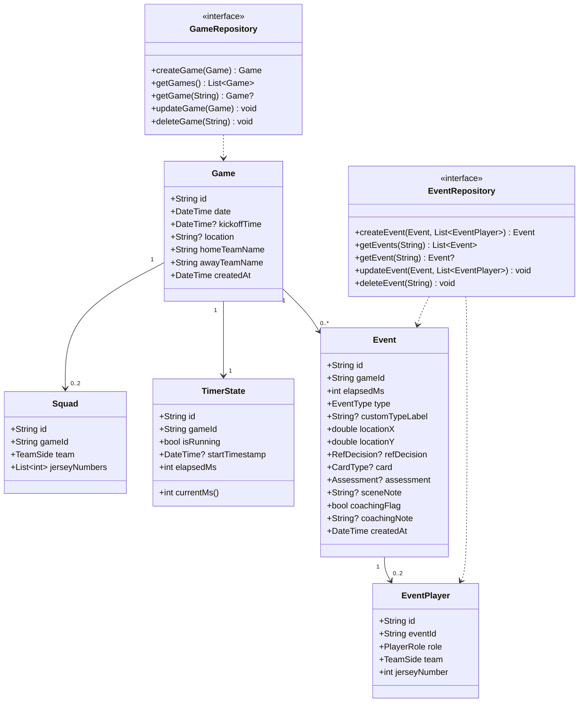

# Architektur — Beobachter-App MVP

> Stack: Flutter (Dart) · Drift (SQLite) · Riverpod
> Plattformen: iOS · Android · Windows (Surface)
> Sprache: Deutsch (kein i18n)

---

## 1. Systemarchitektur

Die App folgt einer **3-Schichten-Architektur** mit Repository-Pattern. Der Repository-Layer abstrahiert alle Datenbankzugriffe und ist später gegen einen Remote-API-Client austauschbar (optionaler Server-Sync).

```
┌─────────────────────────────────────────────────────────────┐
│                      UI Layer                               │
│  Flutter Widgets · Screens · CustomPainter (Spielfeld)      │
│  State: Riverpod (StateNotifier / AsyncNotifier)            │
└────────────────────────┬────────────────────────────────────┘
                         │
┌────────────────────────▼────────────────────────────────────┐
│                   Repository Layer                          │
│  GameRepository · EventRepository                           │
│  SquadRepository · TimerRepository                          │
│  (Interfaces — später gegen Remote-Impl. austauschbar)      │
└────────────────────────┬────────────────────────────────────┘
                         │
┌────────────────────────▼────────────────────────────────────┐
│                    Data Layer                               │
│  Drift (type-safe SQLite Wrapper)                           │
│  Lokale SQLite-Datenbank auf dem Gerät                      │
└─────────────────────────────────────────────────────────────┘
```

### Schlüsselpakete

| Paket | Zweck |
|-------|-------|
| `drift` | Type-safe SQLite ORM mit Migrationssupport |
| `riverpod` | State Management |
| `uuid` | UUID-Generierung für alle Entitäts-IDs |
| `flutter_svg` | Spielfeld-Sketch als SVG |

---

## 2. Datenmodell

### Entitäten

```
┌──────────────────────────────┐
│            Game              │
├──────────────────────────────┤
│ id: String (UUID)            │
│ date: DateTime               │
│ kickoffTime: DateTime?       │
│ location: String?            │
│ homeTeamName: String         │
│ awayTeamName: String         │
│ createdAt: DateTime          │
└──────────────┬───────────────┘
               │ 1
               │
       ┌───────┴────────────────────────────────────────┐
       │                                                │
       │ 0..2                                           │ 1
┌──────▼───────────────────────┐       ┌───────────────▼──────────────┐
│            Squad             │       │          TimerState           │
├──────────────────────────────┤       ├──────────────────────────────┤
│ id: String (UUID)            │       │ id: String (UUID)            │
│ gameId: String (FK)          │       │ gameId: String (FK)          │
│ team: TeamSide               │       │ isRunning: bool              │
│ jerseyNumbers: List<int>     │       │ startTimestamp: DateTime?    │
└──────────────────────────────┘       │ elapsedMs: int               │
                                       └──────────────────────────────┘
               │ 0..*
┌──────────────▼───────────────┐
│            Event             │
├──────────────────────────────┤
│ id: String (UUID)            │
│ gameId: String (FK)          │
│ elapsedMs: int               │  ← Zeit in ms ab Spielstart
│ type: EventType              │
│ customTypeLabel: String?     │  ← nur bei type == custom
│ locationX: double (0.0–1.0)  │
│ locationY: double (0.0–1.0)  │
│ refDecision: RefDecision?    │
│ card: CardType?              │
│ assessment: Assessment?      │
│ sceneNote: String?           │
│ coachingFlag: bool           │
│ coachingNote: String?        │
│ createdAt: DateTime          │
└──────────────┬───────────────┘
               │ 0..2
┌──────────────▼───────────────┐
│         EventPlayer          │
├──────────────────────────────┤
│ id: String (UUID)            │
│ eventId: String (FK)         │
│ role: PlayerRole             │
│ team: TeamSide               │
│ jerseyNumber: int            │
└──────────────────────────────┘
```

### Enumerationen

```dart
enum EventType {
  footFoul,         // Fußvergehen
  bodyFoul,         // Oberkörpervergehen
  handball,         // Handspiel
  unsporting,       // Unsportlichkeit
  violent,          // Tätlichkeit
  offside,          // Abseits
  advantage,        // Vorteilsbestimmung
  goalDecision,     // Torentscheidung
  custom,           // Sonstiges (+ customTypeLabel)
}

enum RefDecision {
  freeKick,         // Freistoß
  penalty,          // Strafstoß
  advantage,        // Vorteil
  playOn,           // Weiterspielen
  yellowCard,       // Verwarnung (Gelb)
  yellowRedCard,    // Feldverweis (GR)
  redCard,          // Feldverweis (R)
  cornerKick,       // Ecke
  goalKick,         // Abstoß
  throwIn,          // Einwurf
  goal,             // Tor/Anstoß
}

enum CardType { yellow, yellowRed, red }

enum Assessment {
  correctExpected,  // Korrekt · Erwartbar
  correctComplex,   // Korrekt · Komplex
  wrongExpected,    // Falsch · Erwartbar
  wrongComplex,     // Falsch · Komplex
}

enum TeamSide { home, away }
enum PlayerRole { fouler, fouled }
```

---

## 3. Persistenzstrategie

### Speicherort

SQLite-Datenbankdatei im App-internen Verzeichnis (kein Cloud-Zugriff, kein Backup ohne explizite Nutzераction). Drift verwaltet Pfad automatisch plattformübergreifend.

### Migrationsstrategie

Drift unterstützt deklarative Schemamigration. Jede Schemaänderung erhält eine Versionnummer. MVP startet mit `schemaVersion = 1`.

### Schreibstrategie

- **Kein Batching** — jedes Event wird unmittelbar nach „Speichern" in die DB geschrieben
- **Kein manuelles Speichern** — Datenverlust durch Batching ausgeschlossen
- `TimerState` wird bei Start/Stop in die DB geschrieben (Timestamp-Ansatz, background-safe)

### Timer-Implementierung (background-safe)

```
Start:  timerState.startTimestamp = now()
        timerState.isRunning = true
        → DB speichern

Stop:   timerState.elapsedMs += now() - startTimestamp
        timerState.isRunning = false
        timerState.startTimestamp = null
        → DB speichern

Anzeige (im Vordergrund):
        currentMs = elapsedMs + (isRunning ? now() - startTimestamp : 0)
        → aktualisiert via Stream/Timer (UI-only, 1s Intervall)

Event-Zeitstempel:
        event.elapsedMs = currentMs beim Tap auf das Spielfeld
```

Dieser Ansatz funktioniert korrekt nach App-Neustart oder Hintergrundwechsel, da die DB den Startzeitpunkt kennt.

### Undo nach Speichern

Nach jedem gespeicherten Event zeigt die App einen `SnackBar` mit „Rückgängig"-Button (5-Sekunden-Fenster). Bei Tap: `EventRepository.deleteEvent(event.id)`. Danach ist der Event endgültig gelöscht. Kein komplexer Undo-Stack.

---

## 4. Internes API (Repository-Interfaces)

```dart
abstract class GameRepository {
  Future<Game> createGame(Game game);
  Future<List<Game>> getGames();
  Future<Game?> getGame(String id);
  Future<void> updateGame(Game game);
  Future<void> deleteGame(String id);
}

abstract class EventRepository {
  Future<Event> createEvent(Event event, List<EventPlayer> players);
  Future<List<Event>> getEvents(String gameId);
  Future<Event?> getEvent(String id);
  Future<void> updateEvent(Event event, List<EventPlayer> players);
  Future<void> deleteEvent(String id);         // für Undo
}

abstract class SquadRepository {
  Future<void> saveSquad(String gameId, TeamSide team, List<int> numbers);
  Future<List<int>> getSquad(String gameId, TeamSide team);
}

abstract class TimerRepository {
  Future<void> saveTimerState(TimerState state);
  Future<TimerState?> getTimerState(String gameId);
}
```

---

## 5. UML-Diagramme

### 5.1 Klassendiagramm



---

### 5.2 Use-Case-Diagramm

```
┌──────────────────────────────────────────────────────────────┐
│                    Beobachter-App                            │
│                                                              │
│  ┌──────────────────────┐   ┌──────────────────────────────┐ │
│  │   Spielverwaltung    │   │     Live-Erfassung           │ │
│  │                      │   │                              │ │
│  │  ○ Spiel anlegen     │   │  ○ Ereignis erfassen         │ │
│  │  ○ Aufstellung       │   │    ├─ Spielfeld antippen     │ │
│  │    erfassen          │   │    ├─ Typ wählen             │ │
│  │  ○ Spieluhr starten  │   │    ├─ Spieler wählen         │ │
│  │  ○ Spieluhr stoppen  │   │    ├─ Entscheidung wählen    │ │
│  │  ○ Spiel öffnen      │   │    ├─ Bewertung wählen       │ │
│  └──────────────────────┘   │    └─ Speichern              │ │
│                              │  ○ Ereignis rückgängig      │ │
│  ┌──────────────────────┐   └──────────────────────────────┘ │
│  │   Nachbearbeitung    │   ┌──────────────────────────────┐ │
│  │                      │   │        Statistik             │ │
│  │  ○ Szenenliste       │   │                              │ │
│  │    anzeigen          │   │  ○ Heatmap anzeigen          │ │
│  │  ○ Szenen filtern    │   │  ○ Zeitachse anzeigen        │ │
│  │  ○ Coaching-Flag     │   │  ○ Spieler-Ranking           │ │
│  │    setzen            │   │    anzeigen                  │ │
│  │  ○ Coaching-Notiz    │   └──────────────────────────────┘ │
│  │    erfassen          │                                     │
│  │  ○ Coaching-Ansicht  │                                     │
│  └──────────────────────┘                                     │
│                                        Akteur: Beobachter    │
└──────────────────────────────────────────────────────────────┘
```

---

### 5.3 Sequenzdiagramm: Ereignis erfassen

```
Beobachter    LiveScreen      TimerService    EventForm      EventRepository    SQLite
    │               │               │              │                │              │
    │─ Tap (x,y) ──▶│               │              │                │              │
    │               │─ currentMs() ▶│              │                │              │
    │               │◀─ elapsedMs ──│              │                │              │
    │               │─ open(x,y, elapsedMs) ──────▶│                │              │
    │               │               │              │                │              │
    │─ Typ wählen ──────────────────────────────── ▶│               │              │
    │─ Spieler wähl.─────────────────────────────── ▶│              │              │
    │─ Entscheidung──────────────────────────────── ▶│               │              │
    │─ Bewertung ────────────────────────────────── ▶│               │              │
    │─ [Speichern] ──────────────────────────────── ▶│               │              │
    │               │              │               │─ createEvent() ▶│              │
    │               │              │               │                │─ INSERT ─────▶│
    │               │              │               │                │◀─ ok ─────────│
    │               │              │               │◀─ Event(id) ───│              │
    │               │◀─ close() + showUndo(id) ────│                │              │
    │               │               │              │                │              │
    │  [optional: Tap "Rückgängig" innerhalb 5s]   │                │              │
    │─ Rückgängig ──▶│               │              │                │              │
    │               │────────────────────────────────── deleteEvent(id) ───────────▶│
    │               │               │              │                │◀─ ok ─────────│
    │               │               │              │                │              │
```

---

## 6. Verzeichnisstruktur (Flutter)

```
lib/
├── main.dart
├── app.dart                    # MaterialApp, Routing
│
├── data/
│   ├── database/
│   │   ├── app_database.dart   # Drift Database-Klasse
│   │   ├── tables/             # Drift Table-Definitionen
│   │   └── daos/               # Data Access Objects
│   └── repositories/
│       ├── game_repository_impl.dart
│       ├── event_repository_impl.dart
│       ├── squad_repository_impl.dart
│       └── timer_repository_impl.dart
│
├── domain/
│   ├── entities/               # Game, Event, EventPlayer, Squad, TimerState
│   ├── enums/                  # EventType, RefDecision, CardType, Assessment, …
│   └── repositories/           # Abstract Repository Interfaces
│
├── presentation/
│   ├── providers/              # Riverpod Providers
│   ├── screens/
│   │   ├── game_list/          # Startseite
│   │   ├── game_setup/         # Spiel anlegen + Aufstellung
│   │   ├── live/               # Live-Screen (Spielfeld + Uhr)
│   │   ├── event_form/         # Ereignisformular (Side Panel)
│   │   ├── review/             # Szenenliste + Coaching
│   │   └── stats/              # Statistik (Heatmap, Zeitachse, Ranking)
│   └── widgets/
│       ├── pitch_canvas.dart   # Interaktiver Spielfeld-Sketch
│       ├── heatmap_canvas.dart # Heatmap-Overlay
│       ├── timer_display.dart  # Spieluhr-Widget
│       └── assessment_grid.dart # 2×2-Bewertungs-Grid
│
└── core/
    └── timer_service.dart      # Background-safe Timer-Logik
```